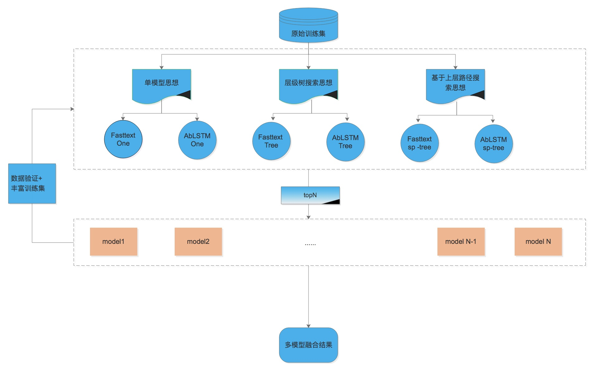

## SIGIR 2018 ECOM  

### 竞赛论文

[**sigir2018官网**](http://sigir.org/sigir2018/ )

[ECOM’18: eCommerce](http://sigir.org/sigir2018/program/workshops/#w6)

[论文接收](https://sigir-ecom.github.io/ecom2018/accepted-papers.html)

[电商竞赛排行榜](https://sigir-ecom.github.io/ecom2018/data-task.html)

### 算法框架：

### 算法思想：

- 利用原始训练数据集变换成不同样本集；
  - 单模型思想直接使用原始标题数据；  
  - 多级分类树思想使用‘a>b>c’转换成‘a’ 'b' 'c'，再利用树搜索方式合并；
  - 多级sp树思想对‘a>b>c’ 转换成‘a’,'a>b','a>b>c'进行处理； 
- 六种单模型：三种数据样本分别使用两种分类算法（ablstm,fasttext）,每个单模型预测topN个结果，增强后续模型融合效果；
- 单模型增强：将某一种单模型下属若干不同参数模型结果融合；
- 模型融合：简单投票，带权重投票，模型加权投票（累计取最大值）。

- 训练集扩充：对于若干融合模型验证，可以筛选一部分正确数据出来加入训练样本中； 
- 新融合训练集验证：新训练集数据进行模型测试，如果效果优于原始样本，可以重新训练生成单模型；

